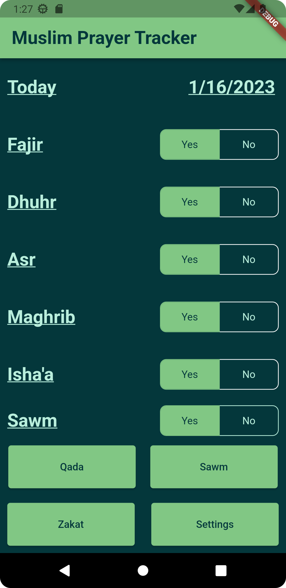

# Muslim Prayer Tracker

A new Flutter project for my CS4750, which allows android users to quickly and easily view and edit the number of prayers, fasts, etc. which they may have in order to make them up at a later date.

## App Description
"Muslim Prayer Tracker is a comprehensive application designed to assist individuals in fulfilling their Islamic obligations with ease. The application offers a user-friendly interface, and an array of features that make it an essential tool for tracking and managing Salah, Sawm and other Islamic obligations.

With Muslim Prayer Tracker, you can keep a log of your daily prayers including any Qadas you may have completed that day, and view your remaining prayers at any time. The app also enables you to maintain a record of your Sawm, including Nathiir, ensuring you never miss a day of fast again. Additionally, you can track any unpaid Zakat you may have, ensuring that your financial obligations are met.

The app is an excellent tool for staying accountable and on track with your Islamic obligations, even when life gets hectic. The progress tracking feature allows you to view your progress and plan for the future. Download Muslim Prayer Tracker today and take control of your spiritual journey with the help of this comprehensive and essential tool."

## Motivations
Background: In Islam it is an obligation to know and follow all five main pillars of Islam: Shahada (profession of faith), Salat (the 5 daily prayers), Zakat (yearly alms towards the poor), Sawm (fasting during Ramadan), and finally Haij (pilgrimage to Mecca). 

Problem: Although we try our best to abide by these pillars, there are times when unforeseen circumstances prevent us from completing some of these obligations (primarily Sawm and Salat). For example if you are sick and cannot fast during Ramadan you are allowed to make up the days you missed any day outside of Ramadan, but must also pay a type special of Zakat known as Zakat el Futrah for each day that is missed (we must pay the equivalent of a single meal). Besides this if an individual misses the morning prayer because they slept-in they will need to remember to make it up at a later time. As such it is important to keep track of the number of days you missed in order to complete the accurate number of make-ups.

Solution: This app strives to to create a simple and efficient way for anyone to quickly record the exact amount of Qadas (seperate tally for each of the 5), Sawm, and Zakat that they need to complete to be caught up with their obligations.

## App Screenshots

## Video Demo
### Click Picture To Be Redirected To YouTube 

## Current Features
- Record prayers completed on a prayer-by-prayer bases
- View and update any missing prayers under "Qada" button
- View and update any missed fasts under "Sawm" button
- View and update any missed Zakat under "Zakat: button
- Dark/Light Mode Options
- Toggle to include a Sawm row along with the rest of the prayers for use during Ramadan/Nathiir
- Toggles automatically default to "Yes" for Prayers and Sawm at start of each day. Qada and Sawm tallies updated to reflect this
- Data persists between sessions

## Build Status
- App development has been completed. 
- Pending Play Store Approval 

## Tech/Framework used
- This app was created using the Flutter extension in Android Studio. The primary language used was dart.
- The app was created with only android products in mind and as such was developed and tested using the Google Pixel 3A emulator provided in Android Studio. 
- External libraries and dependencies:
  - SharedPreferences for data management
  - Cupertino Icons for app icon
  - Synchronized for enforcing app initialization order/process

## Installation
In order to properly download and run the program you will first need to have:
- Android Studio's 
- Flutter/dart projects extension for Android Studio
With these prerequisites completed simply download the project files using Git/GitHub

## How to Use?
- After running your emulated Android device on Android Studio simply click on the toggle buttons Yes/No toggle buttons to specify whether you have or have not completed the specific prayer. The corresponding entry in the Qada section will then be updated to reflect this.
- If you have prior Qada, Sawm, or Zakat that you need to enter, simply click on the corresponding button at the bottom of the screen and find the row with your desired field. After that click on the box in that row and type in the appropriate quantity. When finished hit save.
- Should you want to add a Sawm row, simply press on the Settings button at the bottom of the screen and click the corresponding toggle button. When finished press the save button.
- If you want to change the app's theme to dark mode, simply  simply press on the Settings button at the bottom of the screen and click the corresponding toggle button. When finished press the save button.

